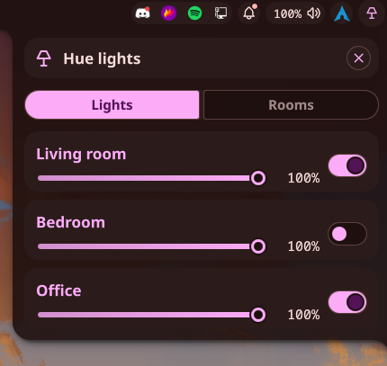

# Philips Hue Plugin

A simple plugin for controlling your Philips Hue lights directly from the taskbar.

## ⚠️ Disclaimer

This plugin is currently very barebones, and lacks support for many core features (such as rooms, color control etc.)
If you would like to implement any of these features, feel free to send a PR.

## Pre-requisites

⚠️ The plugin relies on [`openhue`](https://github.com/openhue/openhue-cli) CLI to be installed, and properly configured with your Hue bridge. If you don't have `openhue` installed and configured correctly, the plugin will fail to detect/control any lights.

## Preview

